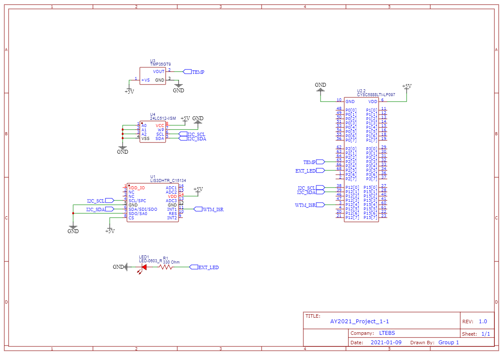

# AY2021\_Project\_1-1

## Requirements

### Software
1. Python >= 3.7.9
1. PSoC Creator >= 4.4
1. python-pip >= 20.3.3

### Hardware
1. PSoC 5LP
1. LIS3DH
1. TMP36 (Temperature sensor)
1. 24LC512 (Ext. EEPROM)


## Installation

### Circuit



### Software dependencies management

#### Windows users
For a basic installation it's required to run these commands on a prompt.
```powershell
# 1. Installing virtualenv
pip install virtualenv;
# 2. Creating empty virtual environment
mkdir venv && virtualenv venv;
# 3. Activating virtual environment
.\venv\Scripts\activate;
# 4. Managing the requirements
pip install -r win_requirements.txt;
garden install graph
```

### \*nix users

Be sure python-pip is installed on your sistem and that the user is a member of the group uucp or dialout.
Run this block if something went wrong when running the program.

*NB*: tested on an Artix linux machine with pacman as package manager and an iMac running macOS Big Sur. The user is kindly asked to check for pip availability on his/her system.

```shell
sudo pacman -Syu
sudo pacman -S python-pip

sudo usermod -a -G uucp $USER
```


The procedure is identical. Dependencies are slightly different.
```shell
# 1. Installing virtualenv
pip install virtualenv;
# 2. Creating empty virtual environment
mkdir venv && virtualenv venv;
# 3. Activating virtual environment
source ./venv/Scripts/activate;
# 4. Managing the requirements
pip install -r mac_gnu_requirements.txt;
garden install graph
```

### Running the program

For both the kind of system it's necessary to run the following command in order to run the GUI program.

```shell
python GUI/main.py
```


*NB*: If y\_label on graphs is upside-down change value (y.angle) in line 428 in Graphs' init.

## Users Guide

### Graphic User Interface


| 	| Command                | Description                                                                                                                                                                                                         |
| --- 	| ---                    | ---                                                                                                                                                                                                                 |
| 1 	| **Ports**              | Selects the COM port to which the device is connected.                                                                                                                                                              |
| 2 	| **Conn./Disconnect**   | Toggles the PSoC-GUI communication.                                                                                                                                                                                 |
| 3 	| **Start/Stop Device**  | Toggles data acquisition (N.B if Stop Device is pressed, the previous acquisitions are still maintained).                                                                                                                          |
| 4 	| **Print Data**         | Returns the stored data in graphical format and automatically saves the session into a *[\%H-\%M-\%S]data.csv*. Data are stored in directories named as *\%F/*. Once done device is turned off and EXT\_EEPROM is reset. |
| 5 	| **Change Settings**    | Allows to select different configurations according to user request, afterwards resets EXT\_EEPROM to avoid data inconsistencies.                                                                                   |
| 6 	| **FSR**                | Full scale range that goes from ±2g to ±16g.                                                                                                                                                                        |
| 7 	| **ODR**                | Output data rate that can be selected as 1Hz, 10Hz, 25Hz, 50Hz.                                                                                                                                                     |
| 8 	| **Temp. Format**       | Selects the temperature measurement unit.                                                                                                                                                                           |
| 9 	| **EEPROM\_Saving**     | Enables/disables EXT\_EEPROM data saving.                                                                                                                                                                           |

### On-Board Controls

1. On-Board Button: if pressed for more than 1s toggles device state between Start/Stop (same as GUI), if pressed for more than 5s reset the EXT\_EEPROM and then restore the last configuration.

### Feedbacks

1. **On-Board LED**: it's toggled among four states.
	1. *Period 1s, DC 0%*: device is in a Stop condition (OFF / IDLE).
	1. *Period 1s, DC 50%*: device is working and saving data in EXT\_EEPROM.
	1. *Period 0.25s, DC 50%*: device is no longer sampling because EXT\_EEPROM is full.
	1. *Period 1s, DC 100%*: EXT\_EEPROM is resetting (the pulse duration depends on the n° of pages been written).
1. **External LED**: switches on when EXT\_EEPROM is being read and data are sent through UART.


## For more technical info

### Datasheets
- [TMP36](https://www.analog.com/media/en/technical-documentation/data-sheets/TMP35_36_37.pdf)
- [LIS3DH](https://www.st.com/resource/en/datasheet/lis3dh.pdf)
- [EEPROM](https://ww1.microchip.com/downloads/en/DeviceDoc/21754M.pdf)


### Application Notes
- [LIS3DH](https://www.st.com/resource/en/application_note/cd00290365-lis3dh-mems-digital-output-motion-sensor-ultralowpower-highperformance-3axis-nano-accelerometer-stmicroelectronics.pdf)
- [EEPROM](http://ww1.microchip.com/downloads/en/AppNotes/01028B.pdf)
